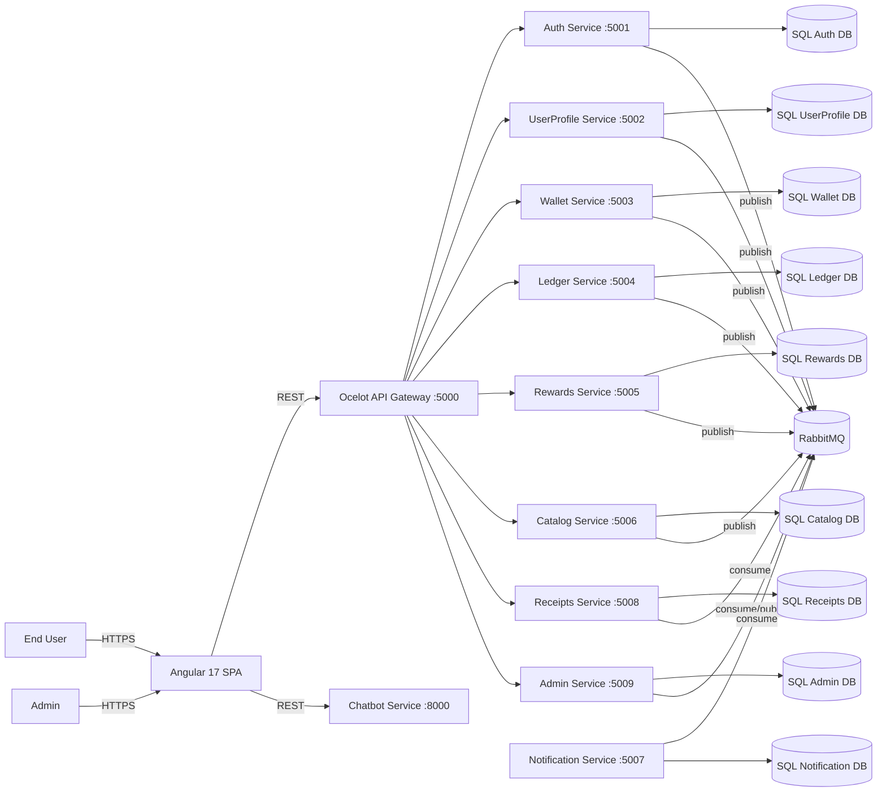

# WalletPlatform — Aurelian
## High-Level Design (HLD)

## 1. Document overview
- **Project name**: WalletPlatform — Aurelian
- **Purpose**: Describe the overall system architecture and design at a solution level.
- **Scope**: Digital wallet, loyalty rewards, KYC workflow, transactions (double-entry), receipts, admin controls, and AI chatbot.
- **Audience**: Architects, stakeholders, developers, QA, DevOps/SRE.

## 2. System overview
WalletPlatform is a microservices-based fintech platform inspired by payment/wallet apps (e.g., Paytm/PhonePe). It provides secure authentication, KYC onboarding, wallet operations, a ledger-backed transaction lifecycle, loyalty rewards with a redemption catalog, notifications, receipts, admin fraud controls, and an AI assistant.

## 3. Business objectives
- **Scalability**: Independently deployable services with horizontal scale.
- **Security & compliance**: JWT-based auth, OTP verification, RBAC, auditable ledger.
- **Reliability**: Idempotency for financial operations; eventual consistency via events.
- **Customer experience**: Angular frontend + AI chatbot for support/FAQs.
- **Operational excellence**: Centralized logging (Serilog), Docker tooling, CI.

## 4. Architecture overview
### 4.1 Architecture style
- **Microservices** with **Clean Architecture** per service (API / Core / Infrastructure).
- **Communication**
  - **Synchronous**: REST (via Ocelot API Gateway)
  - **Asynchronous**: RabbitMQ event-driven messaging
- **Gateway**: Ocelot routes `http://localhost:5000/gateway/...` to downstream services.

### 4.2 Core components
- **Angular frontend**: `frontend/wallet-platform` (UI, auth flows, dashboard, admin, chatbot widget)
- **API Gateway**: `src/Gateway/ApiGateway` (routing + CORS + request logging)
- **.NET microservices**: `src/Services/*Service/*Service.API`
- **Event bus**: RabbitMQ + shared contracts (`src/Shared/Shared.Contracts`, `src/Shared/Shared.EventBus`)
- **Datastores**: SQL Server, **database-per-service**
- **AI chatbot**: Python FastAPI (`chatbot_service`) with Google Gemini

### 4.3 System context (logical)

## 5. Technology stack
| Layer | Technology |
|---|---|
| Frontend | Angular 17 |
| Gateway | Ocelot (ASP.NET Core) |
| Backend | .NET 10, ASP.NET Core Web API |
| AI Chatbot | Python FastAPI, Google Gemini (`gemini-2.5-flash`) |
| Database | SQL Server (database-per-service) |
| Message broker | RabbitMQ |
| Auth | JWT Bearer + Refresh Tokens + OTP verification |
| Logging | Serilog |
| API docs | Swagger (Swashbuckle) |
| DevOps | Docker + GitHub Actions CI |

## 6. Microservices overview (responsibilities)
| Service | Responsibility |
|---|---|
| Auth Service | Registration/login, JWT access & refresh tokens, OTP send/verify, password change |
| UserProfile Service | Profile CRUD, KYC submit/review workflow, email→user lookup |
| Wallet Service | Wallet retrieval/lookup, top-up/deduct, admin freeze/unfreeze, bill split |
| Ledger Service | Transaction initiation and history; publishes transaction outcome events |
| Rewards Service | Rewards account summary/history, internal points deduction, tier logic |
| Catalog Service | Catalog items, redemption flow (calls Rewards), voucher issuance |
| Notification Service | Email notifications (OTP + transactional) and event-driven notifications |
| Receipts Service | Receipt records, PDF generation, CSV export (event-driven + on-demand) |
| Admin Service | Fraud flagging & dashboard stats (admin-only) |
| Chatbot Service | AI assistance for product support and FAQs |

## 7. Deployment architecture (local dev baseline)
- **Local ports** (typical): Gateway `:5000`, services `:5001..5009`, chatbot `:8000`.
- **Docker compose** (`docker/docker-compose.yml`): SQL Server `:1433`, RabbitMQ `:5672` (Mgmt `:15672`).
- **CI**: GitHub Actions builds + tests .NET and builds Angular in production mode.

## 8. Event-driven architecture
### 8.1 Event types (shared contracts)
Defined under `src/Shared/Shared.Contracts/Events/*`:
- `UserRegisteredEvent`
- `KYCStatusUpdatedEvent`
- `TransactionCompletedEvent`
- `TransactionFailedEvent`
- `WalletFrozenEvent`
- `PointsRedeemedEvent`

### 8.2 Exchanges/queues (current contract names)
From `src/Shared/Shared.Contracts/EventQueues.cs`:
- **Exchanges**: `user.exchange`, `transaction.exchange`, `wallet.exchange`, `catalog.exchange`, `dead.letter.exchange`
- **Queues (examples)**:
  - `wallet.creation.queue`
  - `transaction.completed.wallet.queue`
  - `transaction.completed.rewards.queue`
  - `transaction.completed.receipts.queue`
  - `transaction.completed.notification.queue`
  - `transaction.failed.notification.queue`
  - `user.registered.notification.queue`
  - `rewards.user.registered.queue`
  - `kyc.updated.notification.queue`
  - `wallet.frozen.notification.queue`
  - `points.redeemed.queue`
  - `dead.letter.queue`

### 8.3 Why events
- Reduce synchronous coupling between services.
- Enable asynchronous side effects (notifications, rewards updates, receipts creation).
- Support eventual consistency while keeping financial write paths deterministic.

## 9. Security architecture
- **JWT access tokens** for user endpoints; **refresh tokens** for session continuation.
- **OTP verification** for user phone/email verification flows.
- **RBAC**:
  - Admin-only endpoints use role `Admin` (e.g., dashboard, fraud flags, wallet freeze).
- **Gateway boundary**: external clients call gateway URLs; services also expose Swagger per-service for development.

## 10. Non-functional requirements (NFRs)
- **Scalability**: Stateless APIs, scale-out per service.
- **Performance**: Event-driven processing for non-critical path work.
- **Availability**: Fault isolation per service; retries/backoff for event consumers.
- **Reliability**: Idempotency keys for operations that must be safe to retry.
- **Observability**: Structured logging with Serilog; request logging at gateway.
- **Security**: Token-based auth; least privilege via roles.

## 11. Assumptions and constraints
- **Database-per-service** is enforced for ownership boundaries.
- **Local gateway routing** targets `localhost` downstreams (for full Docker-to-Docker, a docker-specific Ocelot config is required).
- Cloud deployment is planned for future phases; local dev is the current default.

