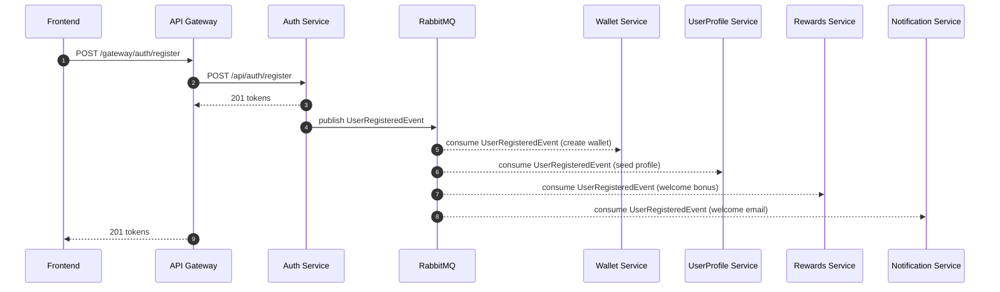
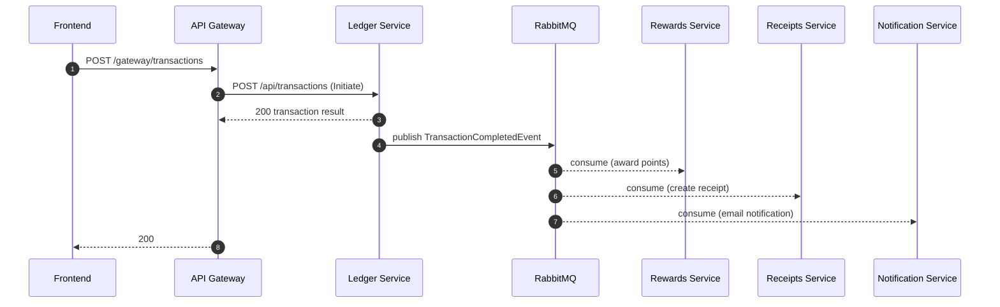
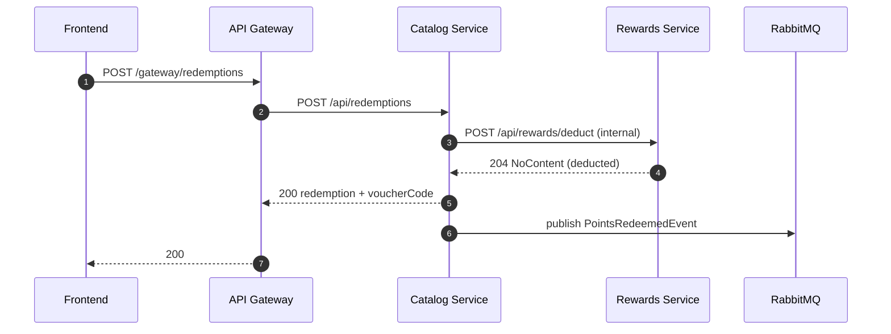

# WalletPlatform — Aurelian
## Low-Level Design (LLD)

## 1. Document overview
- **Purpose**: Describe module-level design details per service: responsibilities, key components, data models, workflows, patterns, and operational concerns.
- **Scope**: Current APIs and event contracts present in this repository.

## 2. Service-level design (module-wise)

### 2.1 Auth Service (`AuthService`)
**Responsibilities**
- User registration and login
- JWT access token + refresh token lifecycle (rotate, revoke)
- OTP send/verify
- Password change

**Key API (service-local)**
- `POST /api/auth/register`
- `POST /api/auth/login`
- `POST /api/auth/refresh`
- `POST /api/auth/revoke` (JWT required)
- `GET /api/auth/me` (JWT required)
- `POST /api/auth/change-password` (JWT required)
- `POST /api/auth/send-otp`
- `POST /api/auth/verify-otp`

**Core components**
- `IAuthService`, `IOtpService` (Core)
- Token generation/validation and refresh token store (Infrastructure)

**Events**
- Publishes `UserRegisteredEvent` (used by wallet/profile/rewards/notification flows)

---

### 2.2 UserProfile Service (`UserProfileService`)
**Responsibilities**
- Profile get/update
- Email lookup to resolve `userId` for “send by email” and admin KYC flows
- KYC submission + admin review

**Key API**
- `GET /api/profile` (JWT) — get-or-create (self-healing)
- `PUT /api/profile` (JWT)
- `GET /api/profile/lookup?email=...` (JWT)
- `GET /api/profile/admin/all?page=&pageSize=` (Admin)
- `POST /api/kyc/submit` (JWT)
- `POST /api/kyc/review/{userProfileId}` (Admin)

**Events**
- Publishes `KYCStatusUpdatedEvent` for notification workflows
- Consumes `UserRegisteredEvent` to seed profiles (with self-healing fallback in API)

---

### 2.3 Wallet Service (`WalletService`)
**Responsibilities**
- Wallet retrieval and user lookup to wallet
- Top-up and deduct operations
- Admin freeze/unfreeze
- Bill splitting (create splits, view created/owed, pay share)

**Key API**
- `GET /api/wallet` (JWT)
- `GET /api/wallet/lookup/{userId}` (JWT)
- `POST /api/wallet/topup` (JWT)
- `POST /api/wallet/deduct` (JWT)
- `POST /api/wallet/admin/freeze/{userId}` (Admin)
- `POST /api/wallet/admin/unfreeze/{userId}` (Admin)
- `POST /api/wallet/billsplit` (JWT)
- `GET /api/wallet/billsplit/created` (JWT)
- `GET /api/wallet/billsplit/owed` (JWT)
- `POST /api/wallet/billsplit/{id}/pay` (JWT)

**Events**
- Consumes `UserRegisteredEvent` for wallet creation (plus self-healing on `GET /wallet`)
- Publishes `WalletFrozenEvent`
- Consumes `TransactionCompletedEvent` (wallet adjustments / reconciliation)

---

### 2.4 Ledger Service (`LedgerService`)
**Responsibilities**
- Initiate transactions (Transfer / TopUp / Payment)
- Provide transaction history and summaries
- Enforce validation (no self-transfer, amount > 0, memo max length)

**Key API**
- `POST /api/transactions` (JWT) — initiates; auto-generates idempotency key if absent
- `GET /api/transactions/summary` (JWT)
- `GET /api/transactions/{transactionId}` (JWT)
- `GET /api/transactions/my?page=&pageSize=` (JWT)

**Events**
- Publishes `TransactionCompletedEvent` and `TransactionFailedEvent`

---

### 2.5 Rewards Service (`RewardsService`)
**Responsibilities**
- Rewards account summary and points history
- Tier progression logic
- Internal points deduction used by catalog redemption

**Key API**
- `GET /api/rewards` (JWT)
- `GET /api/rewards/history` (JWT)
- `GET /api/rewards/account/{userId}` (AllowAnonymous; internal usage)
- `POST /api/rewards/deduct` (AllowAnonymous; internal usage)

**Events**
- Consumes `UserRegisteredEvent` for welcome bonus and account seed (plus self-healing)
- Consumes `TransactionCompletedEvent` for points accrual

---

### 2.6 Catalog Service (`CatalogService`)
**Responsibilities**
- Catalog item listing and admin creation
- Redemption flow: validate stock + points, issue voucher, persist redemption

**Key API**
- `GET /api/catalog` (AllowAnonymous)
- `POST /api/catalog` (Admin)
- `POST /api/redemptions` (JWT)
- `GET /api/redemptions/my` (JWT)

**Integration**
- Synchronous call to Rewards Service to deduct points (`POST /api/rewards/deduct`)

**Events**
- Publishes `PointsRedeemedEvent`

---

### 2.7 Notification Service (`NotificationService`)
**Responsibilities**
- Email notifications via SMTP provider (Gmail SMTP configured in repo)
- Event-driven emails (registration, KYC updates, transaction status, wallet frozen)

**Events**
- Consumes:
  - `UserRegisteredEvent`
  - `KYCStatusUpdatedEvent`
  - `TransactionCompletedEvent`
  - `TransactionFailedEvent`
  - `WalletFrozenEvent`

---

### 2.8 Receipts Service (`ReceiptsService`)
**Responsibilities**
- Receipt storage/query
- PDF rendering and CSV export
- Event-driven receipt creation on transaction completion

**Key API**
- `GET /api/receipts/transaction/{transactionId}` (JWT)
- `GET /api/receipts/transaction/{transactionId}/pdf` (JWT)
- `GET /api/receipts/my` (JWT)
- `GET /api/receipts/export/csv` (JWT)

**Events**
- Consumes `TransactionCompletedEvent`

---

### 2.9 Admin Service (`AdminService`)
**Responsibilities**
- Fraud investigation primitives (flagging transactions)
- Admin dashboard aggregates/statistics

**Key API (Admin-only)**
- `GET /api/admin/dashboard`
- `POST /api/admin/transactions/{transactionId}/flag`
- `GET /api/admin/transactions/fraud-flags`

---

### 2.10 Chatbot Service (`chatbot_service`)
**Responsibilities**
- AI assistance for help/FAQs and platform guidance

**Key API**
- `POST /api/chat`
- `GET /health`

**Notes**
- Uses `GEMINI_API_KEY` from `chatbot_service/.env`; returns `503` when not configured.

## 3. API gateway routing (LLD view)
Gateway upstream to downstream mapping (from `src/Gateway/ApiGateway/ocelot.json`):
- `/gateway/auth/{everything}` → `/api/auth/{everything}` @ `localhost:5001`
- `/gateway/profile/{everything}` → `/api/profile/{everything}` @ `localhost:5002`
- `/gateway/kyc/{everything}` → `/api/kyc/{everything}` @ `localhost:5002`
- `/gateway/wallet/{everything}` → `/api/wallet/{everything}` @ `localhost:5003`
- `/gateway/transactions/{everything}` → `/api/transactions/{everything}` @ `localhost:5004`
- `/gateway/rewards/{everything}` → `/api/rewards/{everything}` @ `localhost:5005`
- `/gateway/catalog/{everything}` → `/api/catalog/{everything}` @ `localhost:5006`
- `/gateway/redemptions/{everything}` → `/api/redemptions/{everything}` @ `localhost:5006`
- `/gateway/receipts/{everything}` → `/api/receipts/{everything}` @ `localhost:5008`
- `/gateway/admin/{everything}` → `/api/admin/{everything}` @ `localhost:5009`

## 4. Data design (logical, per-service DB)
Each service owns its own SQL Server database (database-per-service). Core logical entities across the platform include:
- **Identity**: Users, RefreshTokens, OTP entries
- **Profile/KYC**: UserProfiles, KycDocuments, KycReviews
- **Wallet**: Wallets, WalletHolds/Freezes, IdempotencyKeys
- **Ledger**: Transactions, LedgerEntries (debit/credit), IdempotencyKeys
- **Rewards**: RewardsAccounts, PointsTransactions, Tiers
- **Catalog**: CatalogItems, Redemptions, VoucherCodes, Stock
- **Receipts**: Receipts, ReceiptLineItems/Metadata
- **Admin**: FraudFlags, AuditRecords
- **Notification**: NotificationMessages, DeliveryAttempts

## 5. Key workflows (sequence diagrams)

### 5.1 User registration (happy path)

### 5.2 Transfer (transaction completed)

### 5.3 Catalog redemption (points deduction + voucher)

## 6. Design patterns used
- **Clean Architecture** (API/Core/Infrastructure)
- **Repository pattern** (data access isolation)
- **Service pattern** (domain orchestration)
- **DTO pattern** (no entities exposed over the wire)
- **Result pattern** (`Result<T>` for business outcomes)
- **Idempotency pattern** (safe retries for financial operations)
- **Event-driven integration** (async side effects, eventual consistency)

## 7. Security implementation (LLD)
- JWT bearer authorization on user endpoints; role checks on admin endpoints.
- Gateway CORS policy allows Angular dev origin (`http://localhost:4200`).
- OTP endpoints in Auth Service support dev-friendly behavior (OTP may be returned in Development for testing).

## 8. Logging & monitoring
- Serilog used across services (gateway includes request logging).
- Recommend adding centralized sinks (Seq/ELK/Application Insights) in deployment phase.

## 9. Configuration management
- .NET: `appsettings.json` + `appsettings.Development.json` + environment variables
- Python: `.env` via `python-dotenv`
- Docker: `docker/docker-compose.yml` for local dependencies

## 10. Testing strategy
- **Unit tests**: xUnit in `*Service.Tests`
- **Integration tests** (recommended): API-level tests via Testcontainers / docker-compose

